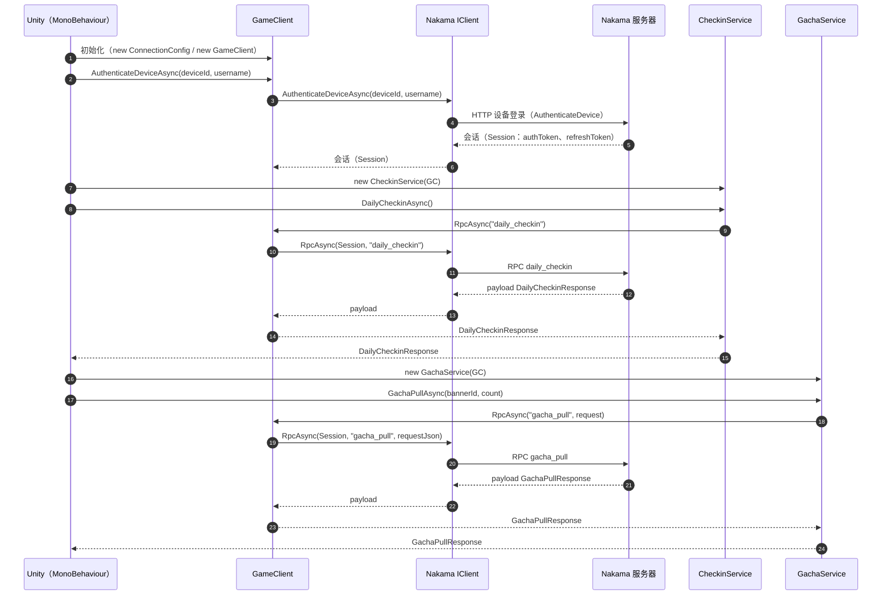
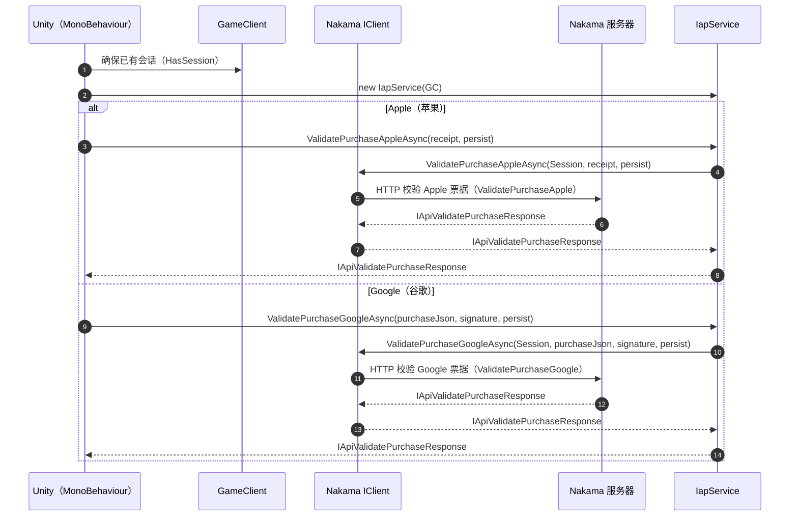

# 使用指南

## 常用调用顺序

1. Init：创建 `ConnectionConfig` 与 `GameClient`
2. AuthenticateDevice：调用 `GameClient.AuthenticateDeviceAsync` 获取并持有 Session
3. Check-in：创建 `CheckinService` 并调用 `GetStateAsync` / `DailyCheckinAsync`（按需补签/补领）
4. GachaPull：创建 `GachaService` 并调用 `GachaPullAsync`
5. IAP（可选）：创建 `IapService` 并调用 `ValidatePurchaseAppleAsync` 或 `ValidatePurchaseGoogleAsync`

抽卡保底机制说明： [保底机制](../../../NakamaMod/gacha_pity.md)

建议在登录成功后缓存 `authToken/refreshToken`，下次启动使用 `GameClient.RestoreSession` 恢复会话；RPC/IAP 调用前确保 `GameClient.HasSession` 为 true。

## 最小示例（Init→AuthenticateDevice→DailyCheckin→GachaPull）

包内已提供可直接挂载运行的脚本：

- `Samples~/MinimalSamples/Runtime/MinimalFlowSample.cs`

核心调用链示意：

```csharp
var config = new ConnectionConfig("127.0.0.1", 7350, "defaultkey", ssl: false);
var client = new GameClient(config);

await client.AuthenticateDeviceAsync(SystemInfo.deviceUniqueIdentifier, "unity_player");

var checkin = new CheckinService(client);
var state = await checkin.GetStateAsync();
var checkinResp = await checkin.DailyCheckinAsync();

var gacha = new GachaService(client);
var gachaResp = await gacha.GachaPullAsync("standard", 1);
```

## 签到（28 日循环）

服务端签到为 28 日循环状态机；建议在展示/交互前先拉取全量状态，再决定是否执行领取/补签/补领。

概念说明与服务端字段： [NakamaMod/README.md（签到）](../../../NakamaMod/README.md#%E7%AD%BE%E5%88%B0%E7%8A%B6%E6%80%81)

### DTO（强类型响应/请求）

- `DailyCheckinResponse`：`daily_checkin` 的响应（包含 `day_id`/`cycle_no`/`cycle_reset`/`status_after`/`multiplier` 等字段）
- `CheckinGetStateResponse`：`checkin_get_state` 的响应（包含 28 天 `days`、`makeup_cost`、门槛信息）
- `CheckinDayState`：`CheckinGetStateResponse.days` 的元素（包含 `status`、`can_makeup`、`can_claim_bonus` 等）
- `CheckinMakeupRequest` / `CheckinMakeupResponse`：补签请求/响应
- `CheckinClaimBonusRequest` / `CheckinClaimBonusResponse`：补领请求/响应

### CheckinService（RPC 封装）

- `GetStateAsync()` → `CheckinGetStateResponse`（RPC：`checkin_get_state`）
- `DailyCheckinAsync()` → `DailyCheckinResponse`（RPC：`daily_checkin`）
- `MakeupAsync(int dayId)` → `CheckinMakeupResponse`（RPC：`checkin_makeup`，`dayId` 范围 1..28）
- `ClaimBonusAsync(int dayId)` → `CheckinClaimBonusResponse`（RPC：`checkin_claim_bonus`，`dayId` 范围 1..28）

调用示例（不包含 UI/表现层）：

```csharp
var checkin = new CheckinService(client);

var state = await checkin.GetStateAsync();
if (!state.success)
{
    throw new Exception($"{state.error_code}: {state.error}");
}

var daily = await checkin.DailyCheckinAsync();
if (!daily.success)
{
    throw new Exception($"{daily.error_code}: {daily.error}");
}

foreach (var day in state.days)
{
    if (day.can_makeup)
    {
        var makeup = await checkin.MakeupAsync(day.day_id);
        if (!makeup.success)
        {
            throw new Exception($"{makeup.error_code}: {makeup.error}");
        }
    }

    if (day.can_claim_bonus)
    {
        var bonus = await checkin.ClaimBonusAsync(day.day_id);
        if (!bonus.success)
        {
            throw new Exception($"{bonus.error_code}: {bonus.error}");
        }
    }
}
```

## IAP 校验示例（伪数据占位）

包内已提供可直接挂载运行的脚本：

- `Samples~/MinimalSamples/Runtime/IapValidationSample.cs`

核心调用链示意：

```csharp
var config = new ConnectionConfig("127.0.0.1", 7350, "defaultkey", ssl: false);
var client = new GameClient(config);
await client.AuthenticateDeviceAsync(SystemInfo.deviceUniqueIdentifier, "unity_player");

var iap = new IapService(client);
await iap.ValidatePurchaseAppleAsync("APPLE_RECEIPT_BASE64_OR_JSON", persist: true);
await iap.ValidatePurchaseGoogleAsync("{\"purchaseToken\":\"TOKEN\"}", "GOOGLE_SIGNATURE", persist: true);
```

## UML 时序图

### 登录 + RPC（签到/抽卡）



### IAP 校验（Apple/Google）



## 异常与错误处理

- 网络/取消/反序列化等错误会以 `SdkException` 抛出；可以统一 catch `SdkException` 做提示与重试策略
- 业务错误通常在响应 DTO 的 `error` / `error_code` 字段中体现（例如 `DailyCheckinResponse.error`、`DailyCheckinResponse.error_code`）
