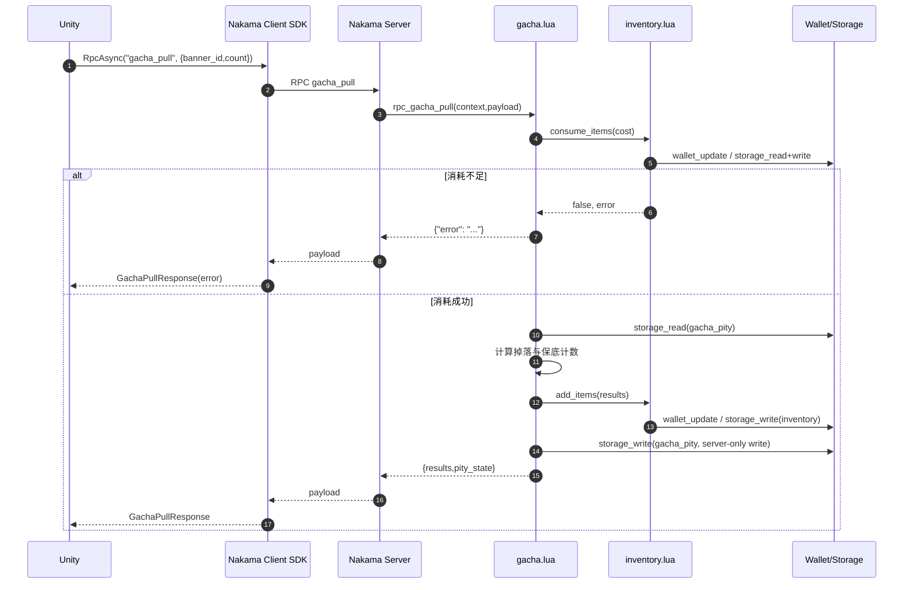
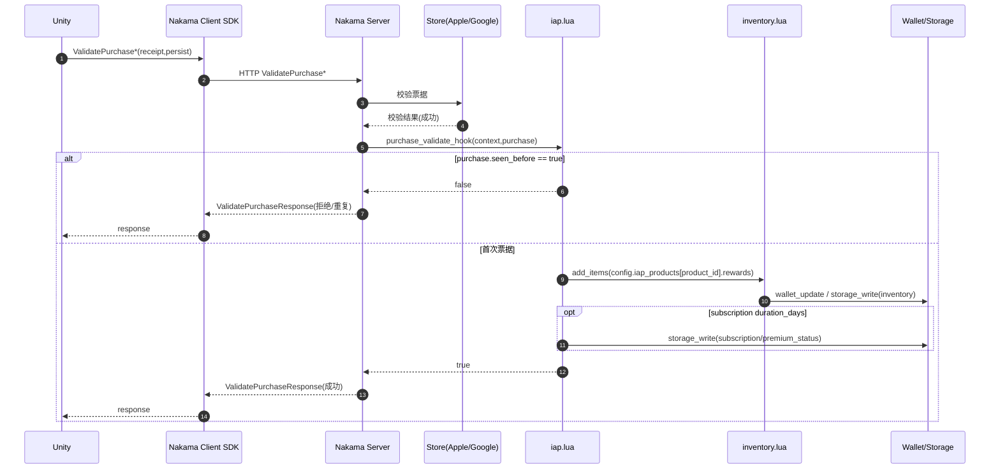
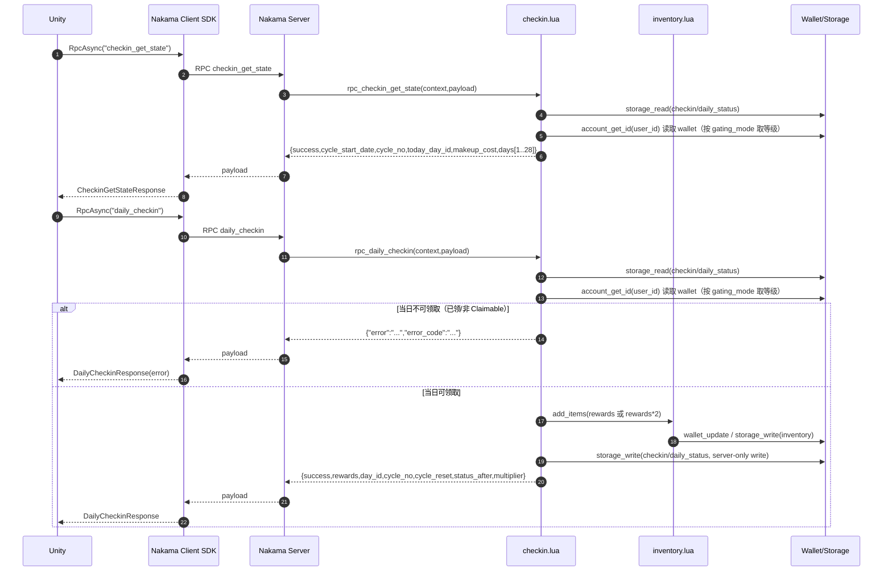

# NakamaServerMod（服务端 Lua 模块说明）

本文档面向客户端与后端联调，说明本目录下 Lua 模块对外暴露的 RPC、IAP 校验与发货逻辑，以及服务端数据结构与存储约定。

入口模块： [main.lua](file:///D:/wkspace/NakamaServerMod/NakamaMod/main.lua)

## RPC 接口

通用约定：

- 鉴权：以下 RPC 均依赖 `context.user_id`，因此需要已登录的 Session（客户端需先完成 AuthenticateDevice/Email/Custom 等任一登录流程）。
- 数据格式：RPC `payload` 为 JSON 字符串；响应为 JSON 字符串。
- 业务错误：以 `{ "error": "...", "error_code": "..." }` 返回（不同 RPC 的 `error_code` 可能为空）；成功时通常包含 `success` 或业务字段。

### 1) debug_add_items

用途：调试发货/补偿用的“加道具”入口（当前实现未做管理员鉴权，建议仅在测试环境启用）。

- RPC 名称：`debug_add_items`
- 鉴权：需要登录 Session
- 请求 payload：`ItemStack[]`

```json
[
  { "id": "gem", "count": 100 },
  { "id": "exp_potion", "count": 5 }
]
```

- 响应：
  - 成功：`{ "success": true }`
  - 失败：`{ "error": "..." }`

副作用：

- 对 `currency` 类型道具：写入 Wallet（见“存储约定”）。
- 对非 `currency` 道具：写入 Storage（collection=`inventory`）。

实现位置： [main.lua](file:///D:/wkspace/NakamaServerMod/NakamaMod/main.lua#L1-L38)、[inventory.lua](file:///D:/wkspace/NakamaServerMod/NakamaMod/inventory.lua)

### 2) gacha_pull

用途：抽卡（支持指定卡池与连抽次数），包含消耗、保底状态维护与发奖。

- 保底机制文档： [保底机制](gacha_pity.md)

- RPC 名称：`gacha_pull`
- 鉴权：需要登录 Session
- 请求 payload：`GachaPullRequest`

```json
{ "banner_id": "standard_banner", "count": 10 }
```

- 响应：`GachaPullResponse`
  - 成功：

```json
{
  "results": [
    { "id": "hero_r_001", "count": 1, "rarity": "R" },
    { "id": "hero_sr_001", "count": 1, "rarity": "SR" }
  ],
  "pity_state": { "ssr_counter": 12, "sr_counter": 3 }
}
```

  - 失败：`{ "error": "Invalid banner ID" }` / `{ "error": "Insufficient currency" }` / `{ "error": "Insufficient item: <id>" }`

关键规则（以当前实现为准）：

- 消耗：按 `banner.cost_item` 与 `banner.cost_amount * count` 扣除（Wallet 或 inventory 物品均可能作为消耗）。
- 保底：读取并更新 `gacha_pity` collection 下的 `pity_<banner_id>` 状态。
  - `ssr_counter >= pity_ssr`：本抽强制 SSR，并将 `ssr_counter` 归零
  - `sr_counter >= pity_sr`：本抽强制 SR，并将 `sr_counter` 归零
  - 普通抽取：按权重抽取；若抽到 SR/SSR，对应计数器归零
- 发奖：按 `results` 逐条发货（走统一的 `inventory.add_items`）。

实现位置： [gacha.lua](file:///D:/wkspace/NakamaServerMod/NakamaMod/gacha.lua)、[inventory.lua](file:///D:/wkspace/NakamaServerMod/NakamaMod/inventory.lua)、[config.lua](file:///D:/wkspace/NakamaServerMod/NakamaMod/config.lua#L15-L28)

### 3) daily_checkin

用途：签到领取（UTC 日期），领取当前 28 日循环中“当日 Claimable 节点”的奖励；支持门槛判定与后置补领。

- RPC 名称：`daily_checkin`
- 鉴权：需要登录 Session
- 请求 payload：无要求（可传空字符串或 `{}`）
- 响应：`DailyCheckinResponse`
  - 成功：

```json
{
  "success": true,
  "rewards": [{ "id": "gold", "count": 3000 }],
  "streak": 4,
  "vip_level": "vip",
  "day_id": 4,
  "cycle_no": 1,
  "cycle_reset": false,
  "gating_mode": "vip",
  "player_level": 2,
  "required_level": 0,
  "status_after": "Claimed",
  "multiplier": 2
}
```

  - 失败：

```json
{ "error": "Already checked in today", "error_code": "CHECKIN_ALREADY_CLAIMED" }
```

```json
{ "error": "Configuration error for day 4", "error_code": "CHECKIN_CONFIG_ERROR" }
```

关键规则（以当前实现为准）：

- 28 日循环：以 `cycle_start_date`（UTC yyyymmdd）为基准计算 `day_id`（1..28）；当日仅 `day_id` 对应节点为 Claimable。
- 去重：若当日节点已处于 `Claimed/Pending_Bonus`，返回 `CHECKIN_ALREADY_CLAIMED`。
- 奖励与门槛：
  - 奖励基数来自 28 日奖励表（`Reward_Item/Num/VIP_Level_Req`）。
  - 若满足门槛（`player_level >= required_level`），本次直接发放双倍（`multiplier=2`）。
  - 若不满足门槛，本次仅发放基础奖励（`multiplier=1`），并将该日标记为 `Pending_Bonus`，后续可通过 `checkin_claim_bonus` 补领差额以达到“双倍”。
- 固定补签消耗：补签走 `checkin_makeup`，消耗来自 `makeup_cost`（固定道具与数量）。
- 跨周期清空：当第 28 日被领取（无论 `daily_checkin` 还是 `checkin_makeup`），立即进入下一轮（`cycle_no + 1`，下一轮 `cycle_start_date = tomorrow(UTC)`），并清空上一轮所有 `Pending_Bonus`（不可跨周期补领）。

实现位置： [checkin.lua](file:///D:/wkspace/NakamaServerMod/NakamaMod/checkin.lua)、[config.lua](file:///D:/wkspace/NakamaServerMod/NakamaMod/config.lua#L27-L84)、[main.lua](file:///D:/wkspace/NakamaServerMod/NakamaMod/main.lua#L28-L36)

### 4) checkin_get_state

用途：查询当前 28 日循环签到的全量状态（包含 28 天状态、补签固定消耗、门槛信息与可操作性标记）。

- RPC 名称：`checkin_get_state`
- 鉴权：需要登录 Session
- 请求 payload：无要求（可传空字符串或 `{}`）
- 响应：`CheckinGetStateResponse`
  - 成功（示例截断，仅展示 days 的前 2 项）：

```json
{
  "success": true,
  "cycle_start_date": "20260301",
  "cycle_no": 1,
  "today": "20260304",
  "today_day_id": 4,
  "gating_mode": "vip",
  "player_level": 0,
  "makeup_cost": { "id": "gem", "count": 30 },
  "days": [
    {
      "day_id": 1,
      "status": "Claimed",
      "reward_item": "gold",
      "reward_num": 1000,
      "required_level": 0,
      "player_level": 0,
      "gating_mode": "vip",
      "claim_multiplier": 2,
      "can_makeup": false,
      "can_claim_bonus": false
    },
    {
      "day_id": 4,
      "status": "Claimable",
      "reward_item": "gold",
      "reward_num": 1500,
      "required_level": 0,
      "player_level": 0,
      "gating_mode": "vip",
      "claim_multiplier": 2,
      "can_makeup": false,
      "can_claim_bonus": false
    }
  ]
}
```

说明：

- `days` 始终为 28 项（`day_id`=1..28）；`status` 为派生状态机输出（见“签到状态（28 日循环）”）。
- `claim_multiplier` 表示“若此刻领取该日奖励，可获得的倍率”（满足门槛为 2，否则为 1）；已领取且处于 `Pending_Bonus` 的日子仍可能显示 `claim_multiplier=2`，表示当前门槛已满足、可以补领。

实现位置： [checkin.lua](file:///D:/wkspace/NakamaServerMod/NakamaMod/checkin.lua#L321-L375)

### 5) checkin_makeup

用途：对 `Missed` 节点进行补签；按固定消耗扣除道具，并按门槛判定发放基础/双倍（不满足门槛时标记为 `Pending_Bonus` 以便后续补领）。

- RPC 名称：`checkin_makeup`
- 鉴权：需要登录 Session
- 请求 payload：`CheckinMakeupRequest`

```json
{ "day_id": 2 }
```

- 响应：`CheckinMakeupResponse`
  - 成功：

```json
{
  "success": true,
  "day_id": 2,
  "rewards": [{ "id": "gem", "count": 20 }],
  "cost": { "id": "gem", "count": 30 },
  "gating_mode": "vip",
  "player_level": 0,
  "required_level": 0,
  "multiplier": 2,
  "cycle_no": 1
}
```

  - 失败（示例）：

```json
{ "error": "Invalid Day_ID", "error_code": "CHECKIN_INVALID_DAY_ID" }
```

```json
{ "error": "Day is not missed", "error_code": "CHECKIN_NOT_MISSED" }
```

```json
{ "error": "Insufficient cost", "error_code": "CHECKIN_INSUFFICIENT_COST" }
```

实现位置： [checkin.lua](file:///D:/wkspace/NakamaServerMod/NakamaMod/checkin.lua#L466-L548)

### 6) checkin_claim_bonus

用途：对 `Pending_Bonus` 节点进行补领（后置补领），用于在“领取当时未达门槛、后续达门槛”时补齐差额，使该日总收益达到“双倍”。

- RPC 名称：`checkin_claim_bonus`
- 鉴权：需要登录 Session
- 请求 payload：`CheckinClaimBonusRequest`

```json
{ "day_id": 7 }
```

- 响应：`CheckinClaimBonusResponse`
  - 成功：

```json
{
  "success": true,
  "day_id": 7,
  "rewards": [{ "id": "hero_r_001", "count": 1 }],
  "gating_mode": "vip",
  "player_level": 2,
  "required_level": 1,
  "cycle_no": 1
}
```

  - 失败（示例）：

```json
{ "error": "Day is not pending bonus", "error_code": "CHECKIN_NOT_PENDING_BONUS" }
```

```json
{ "error": "Gate level not met", "error_code": "CHECKIN_GATE_NOT_MET" }
```

实现位置： [checkin.lua](file:///D:/wkspace/NakamaServerMod/NakamaMod/checkin.lua#L550-L612)

### 7) wallet_get

用途：查询当前账号 Wallet（货币类道具与其它 wallet 字段）。

- RPC 名称：`wallet_get`
- 鉴权：需要登录 Session
- 请求 payload：无要求（可传空字符串或 `{}`）
- 响应：直接返回 `account.wallet` JSON 对象

```json
{ "gold": 1000, "gem": 50, "vip_level": 0 }
```

实现位置： [inventory.lua](file:///D:/wkspace/NakamaServerMod/NakamaMod/inventory.lua#L267-L285)、[main.lua](file:///D:/wkspace/NakamaServerMod/NakamaMod/main.lua#L1-L43)

### 8) inventory_get_items

用途：查询指定 `item_id` 列表在 inventory（Storage collection=`inventory`）中的数量；不存在则返回 0。

- RPC 名称：`inventory_get_items`
- 鉴权：需要登录 Session
- 请求 payload：`InventoryGetItemsRequest`

```json
{ "item_ids": ["exp_potion", "hero_ssr_001"] }
```

也支持直接传数组：

```json
["exp_potion", "hero_ssr_001"]
```

- 响应：`InventoryGetItemsResponse`

```json
{
  "items": [
    { "id": "exp_potion", "count": 5 },
    { "id": "hero_ssr_001", "count": 1 }
  ]
}
```

实现位置： [inventory.lua](file:///D:/wkspace/NakamaServerMod/NakamaMod/inventory.lua#L287-L330)、[main.lua](file:///D:/wkspace/NakamaServerMod/NakamaMod/main.lua#L1-L43)

### 9) inventory_list

用途：分页列出当前账号的 inventory（Storage collection=`inventory`）物品列表。

- RPC 名称：`inventory_list`
- 鉴权：需要登录 Session
- 请求 payload：`InventoryListRequest`

```json
{ "page_size": 100, "cursor": "" }
```

- 响应：`InventoryListResponse`

```json
{
  "items": [
    { "id": "exp_potion", "count": 5, "type": "item" },
    { "id": "hero_ssr_001", "count": 1, "type": "hero" }
  ],
  "cursor": "NEXT_CURSOR_OR_NULL"
}
```

实现位置： [inventory.lua](file:///D:/wkspace/NakamaServerMod/NakamaMod/inventory.lua#L332-L370)、[main.lua](file:///D:/wkspace/NakamaServerMod/NakamaMod/main.lua#L1-L43)

### 10) inventory_log_list

用途：分页查询物品生命周期日志（Storage collection=`inventory_log`），支持时间范围、`item_id`、`source` 过滤。

- RPC 名称：`inventory_log_list`
- 鉴权：需要登录 Session
- 默认权限：只能查询本人日志
- 管理员查询（最小策略，二选一即可）：
  - payload 携带 `admin_token`，与 [config.lua](file:///D:/wkspace/NakamaServerMod/NakamaMod/config.lua) 的 `admin.inventory_log_admin_token` 完全匹配且非空
  - 或调用者 `context.user_id` 在 `admin.inventory_log_user_whitelist` 白名单内

- 请求 payload：`InventoryLogListRequest`

```json
{
  "page_size": 50,
  "cursor": "",
  "start_ts": 1772800000,
  "end_ts": 1772810000,
  "source": "gacha",
  "item_id": "gem"
}
```

管理员代查示例：

```json
{
  "user_id": "TARGET_USER_ID",
  "admin_token": "YOUR_ADMIN_TOKEN",
  "page_size": 50,
  "cursor": ""
}
```

- 响应：`InventoryLogListResponse`

```json
{
  "logs": [
    {
      "key": "20260306_01772810096_550e8400-e29b-41d4-a716-446655440000",
      "user_id": "USER_ID",
      "source": "gacha",
      "items": [{ "id": "gem", "count": -100 }, { "id": "hero_r_001", "count": 1 }],
      "ref": { "banner_id": "standard_banner", "count": 1, "request_id": "..." },
      "ts_utc": "2026-03-06T12:34:56Z",
      "ts": 1772810096
    }
  ],
  "cursor": "NEXT_CURSOR_OR_NULL"
}
```

实现位置： [inventory.lua](file:///D:/wkspace/NakamaServerMod/NakamaMod/inventory.lua#L451-L583)、[main.lua](file:///D:/wkspace/NakamaServerMod/NakamaMod/main.lua#L1-L43)

## IAP 校验与发货

本项目使用 Nakama 内置的“票据校验”能力（Apple/Google），Lua Hook 负责在“校验通过后、事务提交前”进行发货与状态落库。

入口注册： [main.lua](file:///D:/wkspace/NakamaServerMod/NakamaMod/main.lua#L1-L38)

- Apple：`initializer.register_purchase_validate_apple(iap.apple_purchase_validate)`
- Google：`initializer.register_purchase_validate_google(iap.google_purchase_validate)`

### 触发点（客户端视角）

客户端通常通过 Nakama 客户端 SDK 调用：

- Apple：`ValidatePurchaseAppleAsync(session, receipt, persist)`
- Google：`ValidatePurchaseGoogleAsync(session, receiptJson, persist)`

其中 `persist=true` 时，Nakama 会将交易记录持久化，便于重复请求去重与审计（具体行为以 Nakama 配置为准）。

### 服务端处理（当前实现）

校验通过后，Nakama 传入 `purchase` 对象并调用对应 Hook：

- 去重/幂等：若 `purchase.seen_before == true`，直接返回 `false` 拒绝本次处理，避免重复发货。
- 发货：通过 `purchase.product_id` 查 `config.iap_products`，将配置的 `rewards` 交给 `inventory.add_items` 统一发货。
- 订阅示例：若配置 `duration_days`，写入 `subscription` collection，key=`premium_status`，并设置过期时间戳。

返回值语义（Hook -> Nakama）：

- 返回 `true`：允许本次购买处理继续提交
- 返回 `false`：拒绝本次处理（例如重复票据）

实现位置： [iap.lua](file:///D:/wkspace/NakamaServerMod/NakamaMod/iap.lua)、[config.lua](file:///D:/wkspace/NakamaServerMod/NakamaMod/config.lua#L53-L65)

## 数据结构

本文档中的 JSON 结构与 Unity SDK DTO、以及服务端 Lua 实现保持一致。

### ItemStack

通用“道具堆叠”结构，RPC 输入/输出与配置文件均大量使用：

```json
{ "id": "gem", "count": 100 }
```

- `id`：道具 ID（同时用作 Wallet 字段名或 inventory Storage key）
- `count`：数量（正数）

Unity 侧对应： [ItemStack.cs](file:///D:/wkspace/NakamaServerMod/Packages/com.nakamaservermod.unity-sdk/Runtime/ItemStack.cs)

### InventoryLifecycleLog（物品生命周期日志）

服务端对关键的发放/扣除路径写入可分页的日志对象（Storage collection=`inventory_log`），用于后续审计与查询。

```json
{
  "source": "gacha",
  "items": [{ "id": "hero_r_001", "count": 1 }, { "id": "gem", "count": 10 }],
  "ref": { "banner_id": "standard_banner", "count": 10, "request_id": "..." },
  "ts_utc": "2026-03-06T12:34:56Z",
  "ts": 1772810096
}
```

- `source`：来源（`gacha` / `checkin` / `iap` / `debug` / `consume`）
- `items`：数量变化（delta）；发放为正数，扣除为负数
- `ref`：关联信息（不同来源的补充字段；包含 `request_id/username` 等上下文信息）
- `ts_utc`：UTC 时间戳（ISO-8601）
- `ts`：Unix 秒时间戳（便于范围过滤）

### 抽卡请求与结果

`GachaPullRequest`：

```json
{ "banner_id": "standard_banner", "count": 10 }
```

`GachaPullResult`：

```json
{ "id": "hero_sr_001", "count": 1, "rarity": "SR" }
```

`PityState`：

```json
{ "ssr_counter": 12, "sr_counter": 3 }
```

`GachaPullResponse`：

```json
{ "results": [ { "id": "hero_r_001", "count": 1, "rarity": "R" } ], "pity_state": { "ssr_counter": 1, "sr_counter": 1 } }
```

Unity 侧对应： [GachaPullRequest.cs](file:///D:/wkspace/NakamaServerMod/Packages/com.nakamaservermod.unity-sdk/Runtime/GachaPullRequest.cs)、[GachaPullResult.cs](file:///D:/wkspace/NakamaServerMod/Packages/com.nakamaservermod.unity-sdk/Runtime/GachaPullResult.cs)、[PityState.cs](file:///D:/wkspace/NakamaServerMod/Packages/com.nakamaservermod.unity-sdk/Runtime/PityState.cs)、[GachaPullResponse.cs](file:///D:/wkspace/NakamaServerMod/Packages/com.nakamaservermod.unity-sdk/Runtime/GachaPullResponse.cs)

### 签到状态

签到在服务端存储的状态（collection=`checkin`，key=`daily_status`）：

```json
{
  "cycle_start_date": "20260301",
  "cycle_no": 1,
  "days": ["claimed", "missed", "pending_bonus", "empty"]
}
```

说明：

- `cycle_start_date`：本轮 28 日循环的起始 UTC 日期（yyyymmdd）。
- `cycle_no`：循环编号（从 1 开始，每次完成第 28 日领取会 +1）。
- `days`：长度为 28 的数组（下标 1..28）。持久化状态仅使用：
  - `empty`：未落库/未发生（派生时可能变为 `Claimable/Locked/Missed`）
  - `missed`：已错过（可补签）
  - `pending_bonus`：已领取基础奖励但未满足门槛（可后续补领）
  - `claimed`：已完成双倍（已领取/已补领完成）

五态状态机（派生状态，用于客户端显示与操作判断）：

- `Locked`：未来天数，不可领取
- `Claimable`：当日可领取（只能对当日节点执行 `daily_checkin`）
- `Missed`：已错过，可执行 `checkin_makeup`
- `Pending_Bonus`：可执行 `checkin_claim_bonus`（需满足门槛）
- `Claimed`：已完成领取

配置（等效 2 张表 + gating 配置）：

- 28 日奖励表：`config.checkin.rewards[Day_ID] = { Reward_Item, Num, VIP_Level_Req }`
- 补签固定消耗：`config.checkin.makeup_cost = { Cost_Item, Num }`
- gating：
  - `config.checkin.gating_mode`：`vip` / `pass`（默认 `vip`）
  - `config.checkin.gate_level_strategy[mode]`：用于从玩家数据中取门槛等级（当前实现支持从 Wallet 读取指定 key）

`DailyCheckinResponse`（字段节选，完整字段见 DTO）：

```json
{
  "success": true,
  "rewards": [{ "id": "gold", "count": 1000 }],
  "streak": 4,
  "vip_level": "normal"
}
```

Unity 侧对应： [DailyCheckinResponse.cs](file:///D:/wkspace/NakamaServerMod/Packages/com.nakamaservermod.unity-sdk/Runtime/DailyCheckinResponse.cs)

## 存储与权限约定

### Wallet（账号钱包）

用于存放“货币类”道具（`config.items[<id>].type == "currency"`），字段名即道具 ID，例如：

- `gold` / `gem` / `energy`：货币数量
- `vip_level` / `pass_level`：用于签到门槛判定（由 `config.checkin.gating_mode` 与 `gate_level_strategy` 决定取哪个字段）

写入方式：`nk.wallet_update(user_id, changes, metadata, true)`

- `changes`：形如 `{ "gem": 100, "gold": -500 }`
- 扣除时传负数；当 `check=true` 时，余额不足会失败

实现位置： [inventory.lua](file:///D:/wkspace/NakamaServerMod/NakamaMod/inventory.lua)

### Storage（对象存储）

Nakama Storage 的关键约定：`collection` + `key` + `user_id` 唯一定位对象；写入时可带 `version` 进行乐观并发控制。

权限取值约定（Nakama 默认语义）：

- `permission_read`：0 无人可读 / 1 仅拥有者可读 / 2 公开可读
- `permission_write`：0 仅服务器可写 / 1 仅拥有者可写

#### inventory（非货币道具背包）

- collection：`inventory`
- key：道具 ID（例如 `exp_potion`、`hero_ssr_001`）
- value：

```json
{ "count": 15, "type": "item" }
```

- 权限：`permission_read=1`，`permission_write=1`

读写位置： [inventory.lua](file:///D:/wkspace/NakamaServerMod/NakamaMod/inventory.lua)

#### inventory_log（物品生命周期日志）

- collection：`inventory_log`
- key：`<YYYYMMDD>_<unix_sec_10digits>_<uuid>`（示例：`20260306_01772810096_550e8400-e29b-41d4-a716-446655440000`）
- value：见上文 `InventoryLifecycleLog` 结构
- 权限：`permission_read=1`，`permission_write=0`

写入位置： [inventory.lua](file:///D:/wkspace/NakamaServerMod/NakamaMod/inventory.lua)

#### gacha_pity（抽卡保底状态）

- collection：`gacha_pity`
- key：`pity_<banner_id>`（例如 `pity_standard_banner`）
- value：

```json
{ "ssr_counter": 12, "sr_counter": 3 }
```

- 权限：`permission_read=1`，`permission_write=0`

读写位置： [gacha.lua](file:///D:/wkspace/NakamaServerMod/NakamaMod/gacha.lua)

#### checkin（签到状态）

- collection：`checkin`
- key：`daily_status`
- value：

```json
{
  "cycle_start_date": "20260301",
  "cycle_no": 1,
  "days": ["claimed", "missed", "pending_bonus", "empty"]
}
```

- 权限：`permission_read=1`，`permission_write=0`

读写位置： [checkin.lua](file:///D:/wkspace/NakamaServerMod/NakamaMod/checkin.lua)

#### subscription（订阅/月卡示例）

- collection：`subscription`
- key：`premium_status`
- value：

```json
{ "expire_at": 1772800000, "active": true }
```

- 权限：`permission_read=1`，`permission_write=0`

读写位置： [iap.lua](file:///D:/wkspace/NakamaServerMod/NakamaMod/iap.lua)

## 常用场景时序图

### 抽卡（gacha_pull）



### IAP 校验与发货（Apple/Google）



### 签到领取（daily_checkin / checkin_makeup / checkin_claim_bonus）


