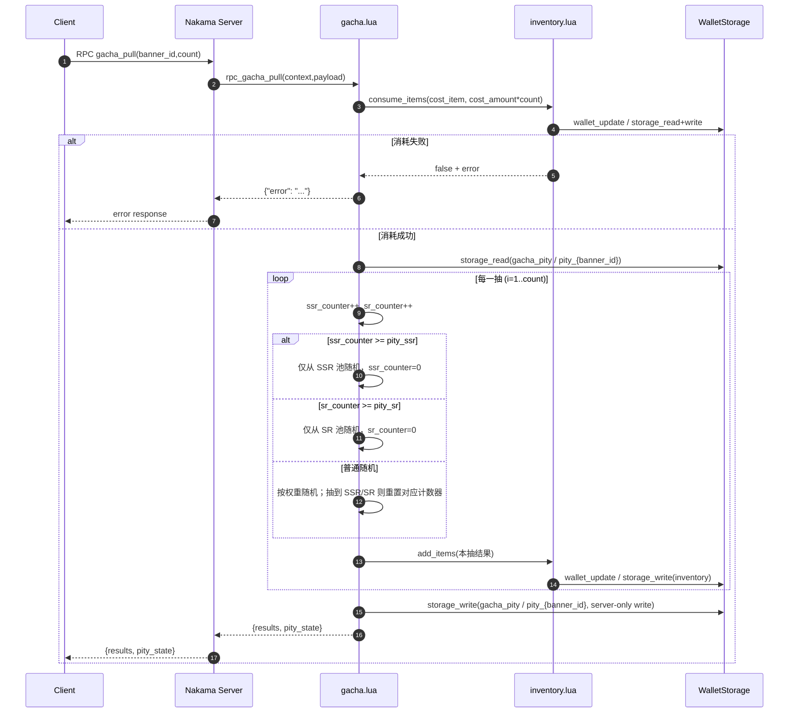

# 抽卡保底机制说明（以当前实现为准）

本文档用于说明 Nakama 服务端 Lua 模块当前实现的抽卡保底机制与状态落库方式。所有规则以当前实现为准：

- 服务端逻辑：[gacha.lua](file:///D:/wkspace/NakamaServerMod/NakamaMod/gacha.lua)
- 卡池配置示例（含保底阈值）：[config.lua](file:///D:/wkspace/NakamaServerMod/NakamaMod/config.lua)

## 策划视角（先读这一节）

本节不要求你理解任何代码或字段名，只从“玩家承诺/策划规则”的角度说明当前系统到底支持什么保底、怎么触发、会不会互相影响。

### 当前支持的保底类型与数量

当前实现对每个卡池（`banner_id`）同时维护两套独立保底计数：

- SSR 保底：1 套计数器（达到阈值时，本抽必出 SSR）
- SR 保底：1 套计数器（达到阈值时，本抽必出 SR）

结论：每个卡池固定支持 2 种保底（SSR 与 SR），且各卡池之间互不影响（切池等于切换到另一套状态）。

### 规则说明（策划口径）

- 每一次“单抽”（包括十连里的每一抽）都会让 SSR 保底进度与 SR 保底进度同时 +1。
- 判定优先级：如果同一抽同时满足 SSR 与 SR 的保底条件，优先给 SSR。
- 两个保底互不抵消、互不清空：
  - 触发 SR 保底不会清空 SSR 保底进度（不会把 SSR “往后推”）
  - 出 SSR 也不会清空 SR 保底进度（SR 进度仍会继续累积）
- 触发保底时的产出是“严格指定稀有度”的池：
  - 触发 SSR 保底时，只会从 SSR 产出池里选一个结果
  - 触发 SR 保底时，只会从 SR 产出池里选一个结果（不会出 SSR）

### 可配置项清单

当前实现已支持（可由配置控制）：

- SSR 保底阈值：`pity_ssr`
- SR 保底阈值：`pity_sr`
- 每个卡池的产出池与权重：`pool`（含 item_id、rarity、weight）
- 每抽消耗：`cost_item`、`cost_amount`

当前实现不包含（仅行业参考/未来扩展方向）：

- SR 保底“SR 及以上”（触发 SR 保底时允许出 SSR）
- SSR 同时重置 SR（或 SR 同时重置 SSR）
- 软保底（接近阈值逐步提升概率）
- 十连保底（每 10 抽至少 1 张 SR 或以上，独立于逐抽计数器）

### 策划用例（用于对外解释）

以下用例描述的是“规则承诺”，不依赖具体概率。

1. 用例 1：新玩家首次抽卡（从 0 开始）
   - 玩家首次在某卡池抽卡时，SSR 与 SR 两条保底进度都从 0 开始累计。

2. 用例 2：十连中第 10 抽 SR 保底
   - 如果玩家在某卡池连续 9 抽都没有出 SR，那么第 10 抽必出 SR。
   - 同时，SSR 保底进度仍正常累计（不会因这次 SR 保底被清空）。

3. 用例 3：SR 保底不会影响紧接着的 SSR 保底
   - 如果玩家已经接近 SSR 保底阈值，哪怕中途触发了一次 SR 保底，也不会把 SSR 保底“往后推”，SSR 仍会按进度准时触发。

4. 用例 4：抽到 SSR 不会清空 SR 进度
   - 玩家在普通抽取中途抽到 SSR 后，SR 保底进度不会被清空；如果 SR 进度已经很接近阈值，仍可能在后续几抽触发 SR 保底。

5. 用例 5：切池互不影响
   - 玩家在 A 卡池抽了 30 抽攒了一定保底进度，切换到 B 卡池抽卡时，B 卡池从自己的进度开始累计；A 卡池进度会被保留，之后再切回 A 卡池仍继续累计。

## 目录（技术章节导航）

- [术语定义](#术语定义)
- [当前实现的核心结论](#当前实现的核心结论)
- [状态字段与语义](#状态字段与语义)
- [存储落库（Storage）与权限](#存储落库storage-与权限)
- [抽卡流程（时序图）](#抽卡流程时序图)
- [主流变体（参考，不在当前实现中）](#主流变体参考不在当前实现中)
- [示例演算（以示例配置为例）](#示例演算以示例配置为例)

## 阅读指南

本文档分为两部分：

- 当前已实现规则：以 [gacha.lua](file:///D:/wkspace/NakamaServerMod/NakamaMod/gacha.lua) 为准，下面的大部分内容都属于这一部分。
- 主流变体（参考）：仅用于对照行业常见做法，帮助理解“当前实现不是那样做的”；不会改变当前实现的语义。

## 术语定义

- 保底：当“计数器”达到阈值时，本次抽取强制产出指定稀有度（SR 或 SSR）。
- 计数器：服务端为每个卡池维护的两个整数状态：`ssr_counter` 与 `sr_counter`。
- 卡池（Banner）：一次抽卡指定的 `banner_id`，对应 `config.gacha[banner_id]`。
- 稀有度：当前实现使用字符串 `"SSR" | "SR" | "R"`。
- 连抽：一次请求 `count > 1`，在服务端循环执行多次抽取与计数器更新。
- 切池：在不同的 `banner_id` 之间切换抽卡；各卡池保底状态相互独立（不同 Storage key）。

## 当前实现的核心结论

1. 每一抽开始时会同时执行：
   - `ssr_counter = ssr_counter + 1`
   - `sr_counter = sr_counter + 1`
2. 保底判定优先级：先 SSR 保底，再 SR 保底，最后才是普通随机。
3. 两个计数器相互独立：
   - 触发 SR 保底不会重置 `ssr_counter`
   - 抽到 SSR（无论是保底还是普通随机）不会重置 `sr_counter`
4. 每个 `banner_id` 都有独立的保底状态对象：`gacha_pity / pity_<banner_id>`。

## 状态字段与语义

### `pity_state` 结构

服务端在 RPC 响应中返回 `GachaPullResponse`：

```json
{
  "results": [{ "id": "hero_r_001", "count": 1, "rarity": "R" }],
  "pity_state": { "ssr_counter": 12, "sr_counter": 3 }
}
```

- `results`：本次抽取的结果数组；其中 `id` 来自 `config.gacha[banner_id].pool[].item_id`，`rarity` 来自 `pool[].rarity`。
- `ssr_counter`：距离“上一次将 ssr_counter 置 0”的抽数（精确以实现为准：每抽先 +1，再按规则可能置 0）。
- `sr_counter`：距离“上一次将 sr_counter 置 0”的抽数（同上）。

### 递增、触发与重置规则（逐抽执行）

对每一次单抽（包含连抽中的每一抽），按以下顺序执行：

1. 计数器递增：
   - `ssr_counter += 1`
   - `sr_counter += 1`
2. SSR 保底检查：
   - 若 `ssr_counter >= pity_ssr`：本抽强制 SSR，并在选出结果后将 `ssr_counter = 0`
3. SR 保底检查：
   - 否则若 `sr_counter >= pity_sr`：本抽强制 SR，并在选出结果后将 `sr_counter = 0`
4. 普通随机：
   - 否则：按 `banner.pool` 权重随机一个条目
   - 若随机结果稀有度为 `"SSR"`：将 `ssr_counter = 0`
   - 若随机结果稀有度为 `"SR"`：将 `sr_counter = 0`
   - 若随机结果稀有度为 `"R"`：两个计数器都不重置

### 状态变化速查表

| 本抽路径         | 产出稀有度 | `ssr_counter` 变化 | `sr_counter` 变化 |
| ---------------- | ---------- | ------------------ | ----------------- |
| SSR 保底         | SSR        | 先 +1，后置 0      | 仅 +1（不置 0）   |
| SR 保底          | SR         | 仅 +1（不置 0）    | 先 +1，后置 0     |
| 普通随机抽到 SSR | SSR        | 先 +1，后置 0      | 仅 +1（不置 0）   |
| 普通随机抽到 SR  | SR         | 仅 +1（不置 0）    | 先 +1，后置 0     |
| 普通随机抽到 R   | R          | +1                 | +1                |

### 边界行为说明

- 同一抽内如果两个阈值都满足（例如 `ssr_counter` 与 `sr_counter` 同时达到阈值），由于 SSR 保底先判断，因此本抽会走 SSR 保底逻辑，SR 保底不会执行。
- SR 保底仅从 `"SR"` 池内抽取，不会抽到 SSR；SSR 保底仅从 `"SSR"` 池内抽取。
- 本实现没有“SR 保底允许 SR 及以上”之类的逻辑；是严格强制指定稀有度的池。

## 存储落库（Storage）与权限

### collection / key 规则

保底状态存储在 Nakama Storage：

- collection：`gacha_pity`
- key：`pity_<banner_id>`（例如 `pity_standard_banner`）
- user_id：当前登录用户的 `context.user_id`
- value：`{ "ssr_counter": number, "sr_counter": number }`

### 读写权限

写入时显式设置权限：

- `permission_read = 1`：仅拥有者可读（客户端在已登录的前提下可读到自己的对象）
- `permission_write = 0`：仅服务器可写（客户端不可直接改保底状态）

### 版本字段（乐观并发控制）

服务端会先 `storage_read`，若读到对象则带出 `version`，随后 `storage_write` 时携带同一个 `version` 写回。

- 如果对象不存在：`version` 为空，写入会创建新对象（初始计数器默认为 0）。
- 如果同一用户对同一 `banner_id` 并发发起抽卡，可能产生版本冲突导致写入失败（当前实现未做重试/合并）。

## 抽卡流程（时序图）



## 主流变体（参考，不在当前实现中）

以下是常见抽卡保底实现的差异点，用于对照理解；当前实现不包含这些规则：

- SR 保底“SR 及以上”：触发 SR 保底时允许抽到 SSR（当前实现严格只从 SR 池中抽取）。
- SSR 会同时重置 SR：抽到 SSR（包括 SSR 保底或普通随机抽到）时也会把 `sr_counter` 置 0（当前实现不会重置）。
- 软保底（Soft pity）：接近阈值时逐步提高 SSR/SR 概率，而不是到阈值才强制（当前实现是到阈值强制）。
- 十连保底：每次十连至少出 1 张 SR（或以上），独立于单抽计数器（当前实现只有逐抽计数器逻辑）。

## 示例演算（以示例配置为例）

以下示例使用 `standard_banner` 配置（见 `config.gacha.standard_banner`）：

- `pity_sr = 10`
- `pity_ssr = 90`

为便于演算，下列示例会“假设”普通随机的结果；只有触发保底的那一抽结果是确定的。

### 示例 1：一次 10 连抽，直到第 10 抽触发 SR 保底

初始状态（落库中不存在或为 0）：

- `ssr_counter = 0`
- `sr_counter = 0`

假设前 9 抽普通随机都抽到 R：

| 抽数 | 本抽开始递增后 | 是否触发保底      | 本抽结果   | 本抽结束后的计数器 |
| ---: | -------------- | ----------------- | ---------- | ------------------ |
|    1 | (1,1)          | 否                | R          | (1,1)              |
|    2 | (2,2)          | 否                | R          | (2,2)              |
|    3 | (3,3)          | 否                | R          | (3,3)              |
|    4 | (4,4)          | 否                | R          | (4,4)              |
|    5 | (5,5)          | 否                | R          | (5,5)              |
|    6 | (6,6)          | 否                | R          | (6,6)              |
|    7 | (7,7)          | 否                | R          | (7,7)              |
|    8 | (8,8)          | 否                | R          | (8,8)              |
|    9 | (9,9)          | 否                | R          | (9,9)              |
|   10 | (10,10)        | SR 保底（10>=10） | SR（强制） | (10,0)             |

结论：在“连续 9 抽都未抽到 SR”的前提下，第 10 抽会强制给 SR；同时 `ssr_counter` 不会被 SR 保底重置，因此仍为 10。

### 示例 2：触发 SR 保底，但不影响下一抽的 SSR 保底（边界）

初始状态（来自落库）：

- `ssr_counter = 88`
- `sr_counter = 9`

连续两抽：

**第 1 抽**

- 递增后：`(ssr_counter, sr_counter) = (89, 10)`
- SSR 保底：`89 >= 90` 不成立
- SR 保底：`10 >= 10` 成立 → 强制 SR
- 结束后：`ssr_counter = 89`（不变），`sr_counter = 0`

**第 2 抽**

- 递增后：`(90, 1)`
- SSR 保底：`90 >= 90` 成立 → 强制 SSR
- 结束后：`ssr_counter = 0`，`sr_counter = 1`（不因 SSR 保底被重置）

结论：SR 保底不会重置 `ssr_counter`，因此不会“推迟”即将到来的 SSR 保底。

### 示例 3：切池（不同 banner_id 互不影响）

保底状态的 Storage key 与 `banner_id` 绑定：

- `standard_banner` → `gacha_pity / pity_standard_banner`
- `event_banner`（假设存在）→ `gacha_pity / pity_event_banner`

假设用户在 `standard_banner` 抽了 5 抽且都未触发重置：

- `pity_standard_banner` 变为 `(5,5)`

切换到 `event_banner`：

- 读取 `pity_event_banner`
  - 若该对象不存在，则从 `(0,0)` 开始累计
  - 抽 3 抽后会落到 `(3,3)`（同样按该池自己的阈值与掉落规则更新）

再切回 `standard_banner`：

- 继续从 `pity_standard_banner = (5,5)` 累计

补充：当前示例配置中仅存在 `standard_banner`；若传入未配置的 `banner_id`，请求会直接返回 `{"error":"Invalid banner ID"}`，不会扣费也不会更新任何保底状态。

### 示例 4：普通随机抽到 SSR，不会重置 SR 计数器（边界）

初始状态：

- `ssr_counter = 20`
- `sr_counter = 8`

假设下一抽未触发保底且普通随机抽到了 SSR：

**第 1 抽**

- 递增后：`(21, 9)`（未达到任何保底阈值）
- 普通随机结果：SSR
- 结束后：`ssr_counter = 0`，`sr_counter = 9`（不被 SSR 重置）

**第 2 抽**

- 递增后：`(1, 10)`
- SR 保底：`10 >= 10` 成立 → 强制 SR
- 结束后：`ssr_counter = 1`，`sr_counter = 0`

结论：即便刚抽到 SSR，SR 计数器仍可能继续累积并在下一抽触发 SR 保底。
