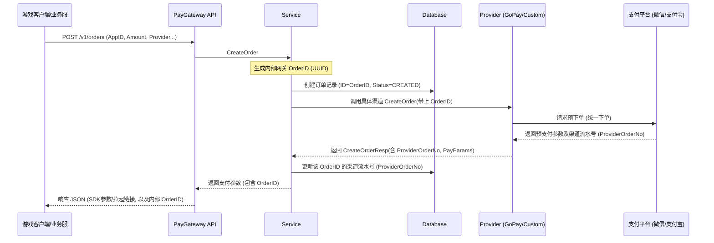
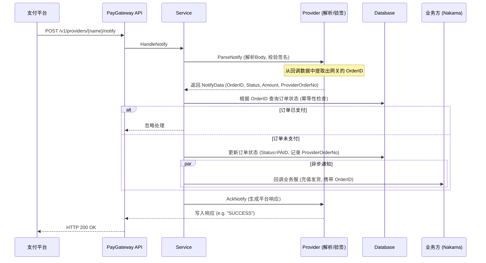

# PayGateway 支付网关

PayGateway 是一个基于 Go 语言编写的支付网关服务，旨在为游戏后端提供统一的支付接口。它集成了 [GoPay](https://github.com/go-pay/gopay) 以支持微信、支付宝等主流支付渠道，并设计了插件化架构以轻松接入自定义支付平台。

## 核心特性

- **多渠道支持**：内置微信支付、支付宝（通过 GoPay），支持自定义 HTTP 支付接口。
- **统一接口**：对外提供统一的下单与回调接口，屏蔽不同支付渠道的差异。
- **插件化架构**：通过 `Provider` 接口轻松扩展新的支付方式。
- **持久化**：支持 PostgreSQL/MySQL（GORM），演示模式下支持内存存储。
- **幂等性与安全**：内置回调防重放校验，通过订单状态机保障不会重复发货。

## 技术栈与框架列表

本项目使用了以下开源框架和库：

- **Web 框架**: [Gin](https://github.com/gin-gonic/gin) - 高性能的 HTTP Web 框架。
- **ORM 框架**: [GORM](https://gorm.io/) - 强大的 Go 语言 ORM 库。
- **支付 SDK**: [GoPay](https://github.com/go-pay/gopay) - 微信、支付宝、PayPal 等聚合支付 SDK。
- **数据库驱动**: [pgx](https://github.com/jackc/pgx) - PostgreSQL 驱动。
- **工具库**:
  - [google/uuid](https://github.com/google/uuid) - UUID 生成。
  - [go-redis/v9](https://github.com/redis/go-redis) - Redis 客户端（用于幂等性与缓存）。

## 核心逻辑时序图

### 1. 统一下单流程



### 2. 支付回调通知流程



## 目录结构说明

```text
PayGateway/
├── cmd/paygateway/      # 程序入口
├── internal/
│   ├── api/             # HTTP 接口层 (Gin Handlers)
│   ├── service/         # 业务逻辑层 (交易流程管控)
│   ├── provider/        # 渠道适配层
│   │   ├── gopay/       # GoPay 集成实现 (微信/支付宝)
│   │   └── custom/      # 自定义渠道实现示例
│   ├── repo/            # 数据持久层 (GORM)
│   └── model/           # 数据库模型定义
└── pkg/config/          # 配置管理
```

## 自定义支付通道 DEMO

自定义支付通道的扩展点是 `internal/provider/provider.go` 中的 `Provider` 接口。你只需要实现接口并在启动时注册即可。

### 1) 实现一个自定义 Provider

示例：新增文件 `internal/provider/custom/demo/demo.go`（仅演示结构与关键方法）。

```go
package demo

import (
	"context"
	"encoding/json"
	"fmt"
	"io"
	"net/http"
	"paygateway/internal/model"
	"paygateway/internal/provider"
)

type DemoProvider struct {
	baseURL          string
	notifyExpectBody string
}

func New(baseURL, notifyExpectBody string) *DemoProvider {
	return &DemoProvider{baseURL: baseURL, notifyExpectBody: notifyExpectBody}
}

func (p *DemoProvider) Name() string { return "demo" }

func (p *DemoProvider) CreateOrder(ctx context.Context, req *provider.CreateOrderReq) (*provider.CreateOrderResp, error) {
	return &provider.CreateOrderResp{
		ProviderOrderNo: "demo_order_" + req.OrderID,
		PayURL:          p.baseURL + "/pay/" + req.OrderID,
		Status:          model.OrderStatusCreated,
	}, nil
}

func (p *DemoProvider) QueryOrder(ctx context.Context, req *provider.QueryOrderReq) (*provider.QueryOrderResp, error) {
	return &provider.QueryOrderResp{
		Status:          model.OrderStatusPaid,
		ProviderOrderNo: req.ProviderOrderNo,
		Amount:          0,
	}, nil
}

func (p *DemoProvider) CloseOrder(ctx context.Context, req *provider.CloseOrderReq) (*provider.CloseOrderResp, error) {
	return &provider.CloseOrderResp{Success: true}, nil
}

func (p *DemoProvider) Refund(ctx context.Context, req *provider.RefundReq) (*provider.RefundResp, error) {
	return &provider.RefundResp{
		ProviderRefundNo: "demo_refund_" + req.RefundID,
		Status:           model.RefundStatusSuccess,
	}, nil
}

func (p *DemoProvider) ParseNotify(ctx context.Context, r *http.Request) (*provider.NotifyData, error) {
	body, err := io.ReadAll(r.Body)
	if err != nil {
		return nil, err
	}

	var m map[string]interface{}
	if err := json.Unmarshal(body, &m); err != nil {
		return nil, err
	}

	orderID, ok := m["order_id"].(string)
	if !ok || orderID == "" {
		return nil, fmt.Errorf("missing order_id")
	}

	return &provider.NotifyData{
		OrderID:         orderID,
		ProviderOrderNo: "demo_txn_" + orderID,
		Status:          model.OrderStatusPaid,
		Amount:          0,
		Currency:        "CNY",
	}, nil
}

func (p *DemoProvider) AckNotify(w http.ResponseWriter) {
	w.WriteHeader(http.StatusOK)
	w.Write([]byte(p.notifyExpectBody))
}
```

### 2) 在启动入口注册 Provider

在 [main.go](file:///D:/wkspace/NakamaServerMod/PayGateway/cmd/paygateway/main.go) 中注册（示意）：

```go
import (
	"paygateway/internal/provider"
	demo_provider "paygateway/internal/provider/custom/demo"
)

func registerProviders() {
	p := demo_provider.New("https://api.example.com", "ok")
	provider.Register(p)
}
```

### 3) 调用方式

- 下单：`POST /v1/orders` 的 `provider` 字段填写 `demo`
- 回调：支付平台回调到 `POST /v1/providers/demo/notify`

## 快速开始

### 前置要求

- Go 1.18+
- PostgreSQL (可选，默认演示模式使用内存存储)

### 数据库自动迁移

系统内置了数据库模型自动迁移功能（`AutoMigrate`）。当 `config.yaml` 中的 `db.type` 配置为 `postgres` 时，系统在启动时会自动连接 PostgreSQL 数据库，并自动创建或更新相应的表结构（`orders`, `refunds`, `callback_logs`），无需手动执行 SQL 脚本。

### 运行服务

```bash
cd PayGateway
go mod tidy
go run ./cmd/paygateway
```

### 接口测试示例

**创建订单**

```bash
curl -X POST http://localhost:8080/v1/orders \
  -H "Content-Type: application/json" \
  -d '{
    "app_id": "game_001",
    "user_id": "user_123",
    "product_id": "gold_pack_1",
    "amount": 100,
    "currency": "CNY",
    "provider": "wechat", 
    "notify_url": "http://localhost:7350/v2/rpc/pay_callback"
  }'
```

**响应示例：**

```json
{
  "OrderID": "550e8400-e29b-41d4-a716-446655440000",
  "ProviderOrderNo": "wx_mock_order_no_550e8400...",
  "PayParams": {
    "nonceStr": "mock_nonce",
    "prepay_id": "mock_prepay_id"
  },
  "PayURL": "",
  "Status": "CREATED"
}
```

**模拟支付回调 (Custom Provider)**

> 💡 **注意**：回调请求中的 `order_id` 必须填写上一步“创建订单”响应中返回的 `OrderID`（即网关内部生成的 UUID，而不是 `ProviderOrderNo`）。

```bash
curl -X POST http://localhost:8080/v1/providers/myprovider/notify \
  -H "Content-Type: application/json" \
  -d '{
    "order_id": "<请填入上一步响应中的 OrderID>",
    "status": "SUCCESS"
  }'
```

## 订单与一致性保障

本系统通过严格的状态机与“本地消息表+定时重试”机制，确保支付与发货的最终一致性。

### 1. 订单状态机

网关内部维护了以下几种订单状态 (`OrderStatus`)：

| 状态         | 说明   | 流转条件                                       |
| :--------- | :--- | :----------------------------------------- |
| `CREATED`  | 已创建  | 客户端发起下单，网关已生成内部订单号并请求了支付渠道。                |
| `PAID`     | 已支付  | 收到支付渠道的成功回调。**此状态为最终态之一，标记此状态后才会通知业务服发货**。 |
| `FAILED`   | 支付失败 | 明确收到渠道的失败通知。                               |
| `CLOSED`   | 已关闭  | 订单超时未支付或被主动取消。                             |
| `REFUNDED` | 已退款  | 订单发生全额或部分退款。                               |

### 2. 幂等性设计

在处理支付平台回调（`HandleNotify`）时，网关实现了严格的幂等性校验，防止重复发货：

1. **状态机拦截**：收到回调后，首先查询内部数据库的订单状态。如果订单状态已经是 `PAID`，则直接向支付渠道返回 `SUCCESS` 应答，**不会**再次触发向业务服（Nakama）的通知。
2. **状态更新与发货原子化**：只有当订单状态从 `CREATED` 成功更新为 `PAID` 后，才会触发后续的发货流程。
3. **回调日志记录**：每一次收到的渠道回调（无论是否触发发货）都会被记录到 `CallbackLog` 表中，便于后续的对账和排障。

### 3. 可靠通知机制 (防掉单)

为了防止网关收到钱但业务服（Nakama）没发货（掉单），系统采用了 **本地消息表 + 定时重试** 方案：

1. **事务落库**：在处理支付回调的同一个数据库事务中，执行以下三步操作：
   - 更新订单状态为 `PAID`
   - 插入一条 `NotifyTask` 记录（状态 `PENDING`）
   - 插入 `CallbackLog`
2. **异步触发**：事务提交后，立即异步尝试调用 Nakama 发货接口。
3. **失败重试**：如果异步调用失败（网络超时或 Nakama 返回非 2xx），`NotifyTask` 状态保持 `PENDING`，并根据**指数退避算法**计算下一次重试时间。
4. **后台兜底**：后台常驻协程（Retryer）会定期扫描到期的 `PENDING` 任务并重新投递，直到成功或达到最大重试次数（默认 10 次）。

## 数据库设计

系统核心表结构如下（基于 GORM 模型）：

### 1. 订单表 (orders)

| 字段                  | 类型        | 说明                          |
| :------------------ | :-------- | :-------------------------- |
| `id`                | string    | 网关内部生成的 UUID，主键             |
| `app_id`            | string    | 游戏/应用 ID                    |
| `user_id`           | string    | 用户 ID                       |
| `amount`            | int64     | 金额（单位：分）                    |
| `provider`          | string    | 支付渠道 (wechat, alipay, etc.) |
| `provider_order_no` | string    | 渠道侧流水号                      |
| `status`            | string    | 订单状态 (CREATED, PAID...)     |
| `created_at`        | timestamp | 创建时间                        |

### 2. 通知任务表 (notify\_tasks)

用于记录发货通知的执行状态，保障最终一致性。

| 字段              | 类型        | 说明                       |
| :-------------- | :-------- | :----------------------- |
| `id`            | string    | 任务 ID                    |
| `order_id`      | string    | 关联的订单 ID                 |
| `status`        | string    | PENDING, SUCCESS, FAILED |
| `retry_count`   | int       | 已重试次数                    |
| `max_retry`     | int       | 最大重试次数                   |
| `next_retry_at` | timestamp | 下次重试时间 (索引)              |

### 3. 回调日志表 (callback\_logs)

记录所有来自支付平台的原始回调数据。

| 字段              | 类型        | 说明     |
| :-------------- | :-------- | :----- |
| `provider`      | string    | 来源渠道   |
| `raw_body`      | text      | 原始报文   |
| `handle_result` | string    | 处理结果描述 |
| `received_at`   | timestamp | 接收时间   |

