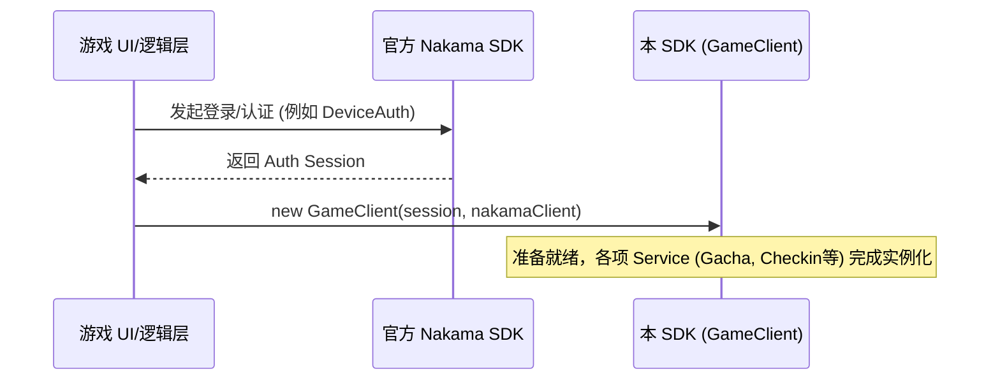
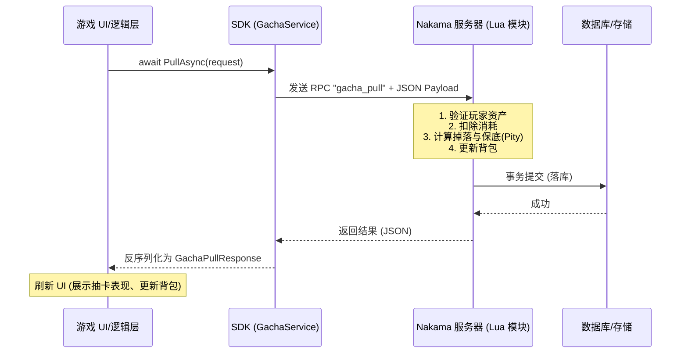
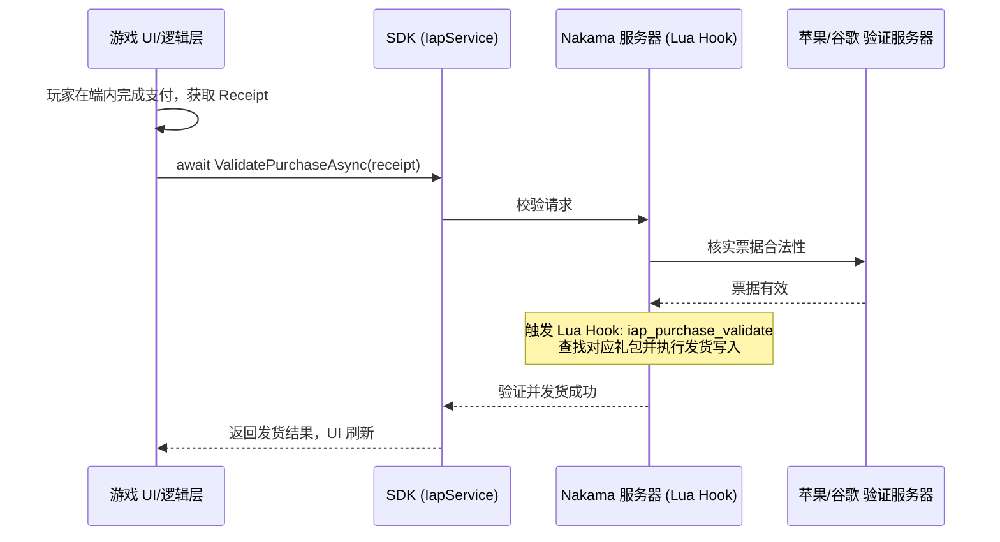

# Nakama Game Mod - Unity SDK

本项目是一个专为 Unity 客户端设计的 SDK，旨在配合服务器端的自定义 Nakama 模块（Nakama Server Mod，基于 Lua）共同使用。它将底层的 Nakama RPC 调用封装为强类型的 C# 异步方法，为开发者提供开箱即用的游戏核心功能模块。

## 🎯 用处与核心功能

本 SDK 作为 Nakama 的上层业务封装，省去了客户端与服务器之间繁琐的 JSON 拼接和底层通信逻辑。核心封装的服务包含：

- **GameClient**：管理客户端生命周期，作为各项子服务的入口。
- **抽卡系统 (GachaService)**：支持发起抽卡请求、获取抽卡结果、记录保底状态（`PityState`）。
- **每日签到系统 (CheckinService)**：基于 28 天周期的签到逻辑，支持状态获取、日常领奖（含额外奖励）以及漏签补签（`CheckinMakeup`）。
- **背包与物品系统 (InventoryService)**：管理玩家的物品栈（`ItemStack`）及资产变更验证。
- **内购系统 (IapService)**：对接 Nakama 的 Apple/Google 票据校验机制，并在校验成功后触发服务器安全发货。
- **调试工具 (DebugAddItems)**：提供在开发环境下的快捷物品发放接口。

## 📦 客户端安装方式 (Unity)

1. **环境依赖**：
   - Unity 2021.3 或更高版本。
   - 配置项目的 `Api Compatibility Level` 为 **.NET Standard 2.1**（在 `Project Settings -> Player` 中设置）。
   - 依赖官方 **[Nakama Unity SDK](https://github.com/heroiclabs/nakama-unity)**，请确保该依赖已导入工程。

### Unity 工程文件说明

仓库中的 [NakamaGameModSDK.slnx](NakamaGameModSDK.slnx) 仅作为工作区占位解决方案保留，不直接引用 Unity 生成的 `.csproj` 文件。

原因是 `Assembly-CSharp.csproj`、`NakamaRuntime.csproj` 这类项目文件由 Unity 在本地打开工程后生成，且已被 `.gitignore` 忽略；如果把它们静态写入解决方案，干净检出的仓库会在 `dotnet restore` 时直接报“未找到项目文件”。

如果你需要本地的 C# 工程文件，请直接用 Unity 打开项目，并在编辑器里重新生成项目文件。

2. **导入 Unity SDK**：
   - **方式一（UPM Git URL 导入 - 推荐）**：打开 Unity 的 Package Manager，点击左上角 `+` -> `Add package from git URL...`，输入以下链接并等待安装完成：
     ```text
     https://github.com/176336109/NakamaGameMod.git?path=Assets/com.nakamaservermod.unity-sdk
     ```
   - **方式二（本地 UPM 包导入）**：将本项目 clone 到本地后，在 Package Manager 中点击 `+` -> `Add package from disk...`，选择本地的 `Assets/com.nakamaservermod.unity-sdk/package.json`。
   - **方式三（源码置入）**：直接将 `Assets/com.nakamaservermod.unity-sdk` 文件夹整个拖入你目标 Unity 游戏工程的 `Assets` 目录下。

## 🚀 服务端部署方式 (Nakama)

本项目内置了配套的 Nakama Lua 服务器模块代码。要使 SDK 正常工作，必须先在 Nakama 服务器中部署这些模块。

1. 定位到底层的 Lua 源码夹：在项目中找到 `Assets/com.nakamaservermod.unity-sdk/NakamaServerMod` 目录。
2. 将目录下所有的 `.lua` 文件（如 `main.lua`、`gacha.lua`、`checkin.lua` 等）放入你的 Nakama 服务器的模块挂载目录 `data/modules` 内。
3. 确保你的 Nakama 配置文件（如 `local.yml`）中正确指定了 runtime path（默认即为 `data/modules`）。
4. 重启 Nakama 容器，查阅 Nakama 启动日志，若看到类似于 `Initialising modules` 和对应模块加载成功的信息，即表示服务端配置完毕。

## 🔄 基本逻辑时序

本 SDK 的基本流转逻辑分为 **“初始化与鉴权”** 以及 **“业务请求流转”** 两个阶段：

### 1. SDK 初始化与鉴权时序
客户端需要先通过 Nakama 的原生 API 完成玩家登录获取 `Session`，然后将其注入到我们的 `GameClient` 中。



### 2. 核心业务请求时序（以发起抽卡为例）
业务模块通过 `xxxService` 交互，内部会自动代理为 RPC 并解析服务器返回的 JSON。



### 3. 内购票据校验时序 (IAP)
利用 Nakama 原生的 `ValidatePurchase`，SDK 及其对应的服务端 Mod 会在验证成功后自动拦截并分发奖励。



## 🛠️ 开始使用

```csharp
// 1. 初始化
var client = new Nakama.Client("http", "127.0.0.1", 7350, "defaultkey");
var session = await client.AuthenticateDeviceAsync(SystemInfo.deviceUniqueIdentifier);

// 2. 实例化定制的游戏客户端 SDK
var gameClient = new NakamaServerMod.UnitySdk.GameClient(client, session);

// 3. 调用具体业务 (例如获取签到状态)
var checkinState = await gameClient.CheckinService.GetStateAsync();
Debug.Log($"当前签到天数: {checkinState.CycleNo}");
```
