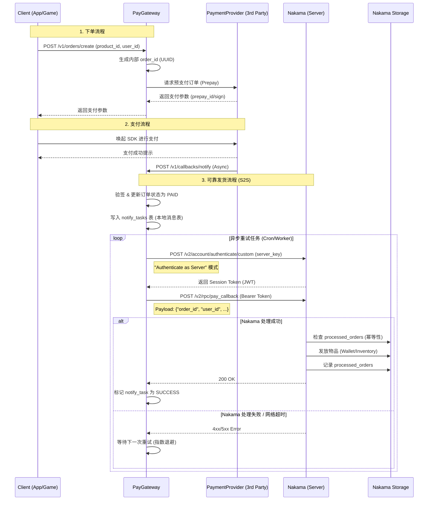
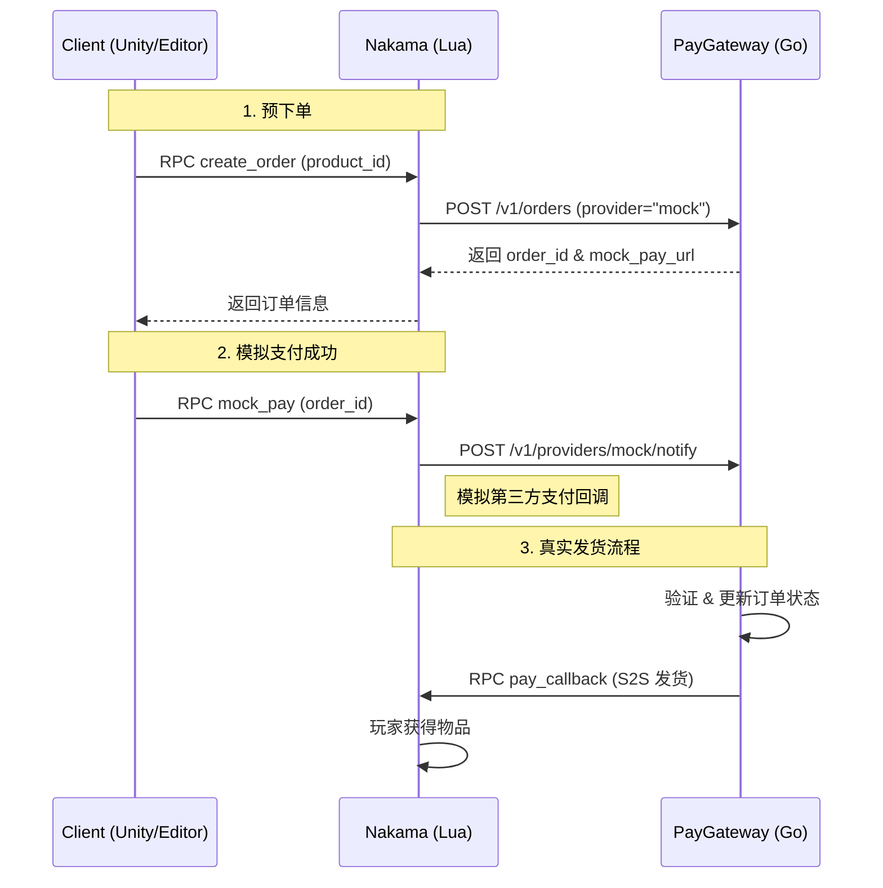

# Server 目录说明与支付系统架构

本目录包含了构建完整游戏支付闭环的两个核心服务组件：
1.  **PayGateway (Go)**: 独立的支付网关，负责对接第三方支付渠道（如微信/支付宝/AppStore），处理订单状态，并保证发货通知的可靠性。
2.  **NakamaServerMod (Lua)**: 运行在 Nakama 服务器内部的 Lua 模组，负责接收网关的发货指令 (RPC)，进行幂等校验，并最终向玩家背包发放道具。

---

## 1. 系统架构与交互流程

### 核心交互时序图



---

## 2. PayGateway (支付网关)

位于 `Server/PayGateway` 目录。

### 关键特性
*   **配置管理**: 使用 `config.yaml` 管理数据库连接、Nakama 地址和 Server Key。
*   **自动迁移**: 启动时自动通过 GORM (`AutoMigrate`) 创建 `orders` 和 `notify_tasks` 表。
*   **结构化日志**: 集成 `Zap` 日志库，提供生产级 JSON 日志，方便追踪 `order_id` 全链路。
*   **可靠通知机制**:
    *   **事务性**: 收到支付回调时，在同一事务中更新订单状态并插入通知任务，确保不丢失通知。
    *   **后台重试**: `retryer.go` 会定期扫描 `notify_tasks` 表中未成功的任务进行重试。
    *   **S2S 鉴权**: 实现了标准的 "Authenticate as Server" 模式。网关不直接使用 HTTP Key，而是使用 `server_key` 换取临时的 Session Token，再以系统用户身份调用 RPC。

### 核心配置 (`config.yaml`)
```yaml
business:
  nakama_api_url: "http://localhost:7350"      # Nakama HTTP API 地址
  nakama_server_key: "defaultkey"              # 必须与 Nakama 配置文件中的 socket.server_key 一致
  nakama_notify_url: "http://localhost:7350/v2/rpc/pay_callback" # RPC 完整路径
```

---

## 3. NakamaServerMod (Lua 模组)

位于 `Server/NakamaServerMod` 目录。

### 关键文件
*   `service/iap_service.lua`: 实现了 `rpc_pay_callback` 函数。
*   `config.lua`: 定义了商品表 `iap_products`，映射 `product_id` 到具体的奖励内容（金币、物品等）。

### RPC 接口详情 (`pay_callback`)

此接口由网关调用，用于发货。

*   **Method**: `POST`
*   **Auth**: `Bearer <SessionToken>` (由网关通过 `server_key` 获取)
*   **Input (JSON String)**: 
    *   Nakama 的 RPC 机制要求 POST Body 必须是 JSON 字符串。
    *   网关发送时会进行二次序列化：`payload = json.dumps(json.dumps(data))`。
    ```json
    {
      "order_id": "8cf04c7f-52a0-4a95-9bcd-e9c8038914f9",
      "user_id": "user_uuid_in_nakama",
      "product_id": "gold_pack_1",
      "amount": 6.00,
      "provider_order_no": "wx_20231027..."
    }
    ```

*   **处理逻辑**:
    1.  **解析**: 解析 JSON Payload。
    2.  **校验**: 检查 `order_id` 是否已存在于 `processed_orders` Storage Collection 中（幂等性检查）。
    3.  **发货**: 根据 `product_id` 查找 `config.lua`，计算奖励并更新用户钱包/背包。
    4.  **记录**: 将 `order_id` 写入 Storage，防止重复处理。

### 核心配置 (`config.lua`)
```lua
M.iap_products = {
    ["gold_pack_1"] = {
        rewards = { 
            { id = "gold", count = 100 },
            { id = "diamond", count = 10 }
        }
    },
    -- 新增商品需在此处配置，否则 RPC 会报 "Unknown product ID"
}
```

---

## 4. 常见问题排查 (Troubleshooting)

### Q1: Gateway 报错 `401 Unauthorized` / `"error": "HTTP key invalid"`
*   **原因**: 网关配置的 `nakama_server_key` 与 Nakama 服务器的 `socket.server_key` 不匹配。
*   **解决**: 检查 `PayGateway/config.yaml` 和 `Nakama/data/config.yaml` 确保一致。注意：我们使用的是 Server Key 进行鉴权，不是 HTTP Key。

### Q2: Nakama 报错 `json: cannot unmarshal object into Go value of type string`
*   **原因**: RPC 调用时，Payload 格式错误。Nakama Go/Lua Runtime 的 RPC 接口期望接收一个 JSON **字符串**作为 Body，而不是直接的 JSON 对象。
*   **解决**: 确保网关代码中对 Payload 进行了 JSON 序列化后再作为 Body 发送（即 Body 内容看起来像 `"{\"foo\":\"bar\"}"`）。

### Q3: Nakama 报错 `Unknown product ID`
*   **原因**: 网关传过来的 `product_id` 在 Nakama 的 `config.lua` 中没有定义。
*   **解决**: 在 `Server/NakamaServerMod/config.lua` 的 `M.iap_products` 表中添加该商品 ID。

### Q4: 订单状态一直卡在 `PAID`，没有变更为 `NOTIFIED`
*   **原因**: 网关到 Nakama 的网络不通，或者 Nakama 报错。
*   **解决**: 
    1. 查看 Gateway 日志 (`zap` log) 确认 HTTP 请求的响应码。
    2. 查看 Nakama 控制台日志 (`docker logs`) 获取具体的 Lua 错误堆栈。

---

## 5. Mock 支付与全链路测试 (New)

为了方便在开发环境验证支付流程，系统引入了 Mock 支付机制。通过 Nakama RPC 模拟完整的“下单 -> 支付通知 -> 发货”闭环，无需真实资金。

### Mock 流程图


### 使用方法

1.  **配置 PayGateway**:
    确保 `Server/PayGateway/config.yaml` 中包含 `mock` provider 配置：
    ```yaml
    providers:
      - name: "mock"
        notify_path: "/v1/providers/mock/notify"
    ```

2.  **配置 Nakama**:
    在 `Server/NakamaServerMod/config.lua` 中设置网关地址：
    ```lua
    M.paygateway_api_url = "http://host.docker.internal:8080"
    ```

3.  **客户端调用 (Unity SDK)**:
    ```csharp
    // 1. 创建订单
    var jsonStr = await iapService.CreateOrderAsync("gold_pack_1");
    var orderInfo = JsonUtility.FromJson<OrderResponse>(jsonStr);
    
    // 2. 模拟支付
    await iapService.MockPayAsync(orderInfo.OrderID);
    ```

4.  **接口测试**:
    可以使用 `Server/PayGateway/Test/Test_MockFlow.http` 直接测试该流程。
